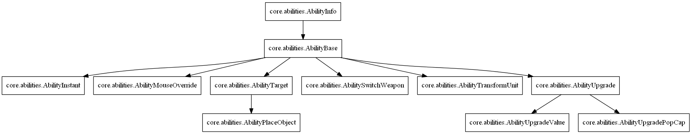

.. _tut-abilities:

**********************************
Abilities
**********************************
Abilities are used everywhere in Lambda Wars. You could see an ability as
an action, which usually involves units and mouse interaction of the player.
Several examples:

  * Producing an unit at a building
  * Ordering an unit to throw a grenade at a target location
  * Ordering an unit to construct a building
  * Using the *unitpanel* to directly spawn an unit at the mouse cursor
  * Throwing a nuke at the mouse cursor using the *abilitypanel*
  * Researching an upgrade at a building
  
AbilityBase Class
============================
The base ability class is like an empty template for creating
new abilities. Normally you do not want to directly derive
from this class, except when you want to do something different.
The class provides several common methods:

  * **Init** - First method called on both client and server. Here you can initialize your ability.
  * **TakeResources** - Takes the amount of resources specified in the costs field of the ability.
  * **Refund** - Refunds the player after doing TakeResources. Usually done after canceling the ability.
  * **Cancel** - Cancel the ability. Refunds the player if resources taken and refundoncancel is set to True.
  * **Completed** - Completes the ability.
  * **SetRecharge** - Sets recharge/cooldown for the specified units.
  * **PlayActivateSound** - Plays the activation sound specified by activatesoundscript.
  * **OnLeftMouseButtonPressed** - Listen to left mouse pressed event.
  * **OnLeftMouseButtonReleased** - Listen to left mouse released event.
  * **OnRightMouseButtonPressed** - Listen to right mouse pressed event.
  * **OnRightMouseButtonReleased** - Listen to right mouse released event.
  * **SelectGroupUnits** - Selects all units in the player selection able to do this ability. The resulting list is available in "self.units".
  * **SelectSingleUnit** - Selects a single best unit able to do this ability. The result is available in "self.unit".
  
When a new ability is created it is also instantiated on the client of the executing player.
This can be used to show visuals for the player executing the ability. For example you might
want to draw a circle on the terrain to indicate the target area.

The following picture is an overview of the available base classes:

See :mod:`core.abilities` for more information about 
the available ability classes and example usage.

