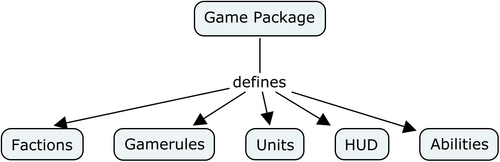

.. _tut-gamepackages:

**********************************
Gamepackages
**********************************
In the previous topic we modified the game package *tutorial*. In 
Lambda Wars all game related code is organized into game packages.
These packages are actual just normal Python packages (see 
`python.org <http://docs.python.org/tutorial/modules.html#packages>`_) 
with the difference they are registered in the
gamemgr module and define methods for loading, unloading and reloading
code.

For example open the __init__.py file of the *tutorial* gamepackage::

    from gamemgr import RegisterGamePackage

    RegisterGamePackage(
        name=__name__,
        dependencies=['core'],
        modules = [
            'gamerules.*',
            'units.*',
            'abilities.*',
        ],
    )
        
**RegisterGamePackage** will register our gamepackage inside the gamemgr module. It uses 
the name of the module (*__name__* is a special variable) and furthermore says we have
a dependency on the core game package. The dependency ensures the code package is
automatically loaded when loading our tutorial game package (if not loaded already).

The modules arguments specify which modules should be imported. Wildcards can be used
to load all modules from a sub directory. The modules list is also used for reloading
the game package.

The *gamemgr* module will do the following when you execute ''load_gamepackage tutorial''
when *tutorial* is not loaded yet:

1. Import the package. The import is supposed to make the gamepackage register.
2. Call LoadGamepackage on all dependencies of the gamepackage.
3. Import all modules of the game package
4. Dispatch a *gamepackagechanged* signal.
5. Send message to all clients to load this gamepackage (and then repeats the above process for each client).

Core and Wars Gamepackage
============================
The *core* gamepackage defines the base classes for Lambda Wars. Most of
the time when creating a new units, abilities, or anything you will use this gamepackage.

The *wars_game* gamepackage defines the actual game and contains all the rebels and 
combine units, buildings, the different gamemodes and the huds.
