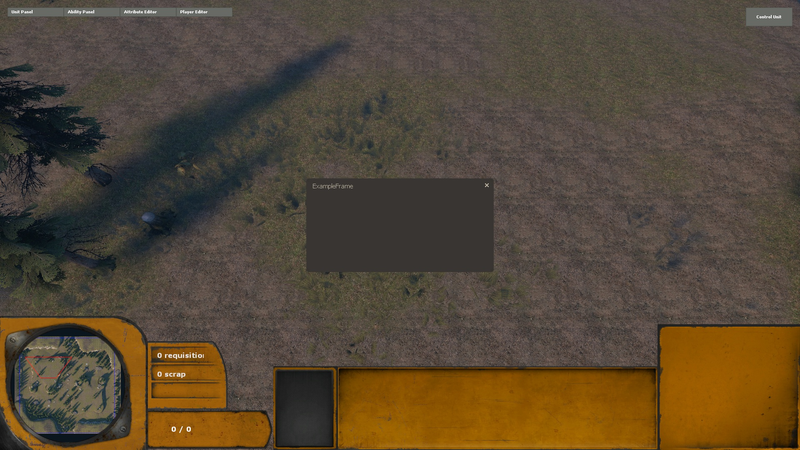
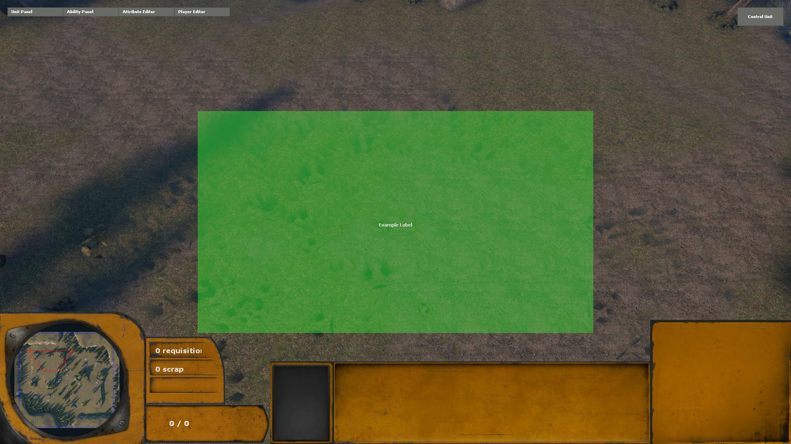

.. _tut-hud:

**********************************
HUD and VGUI
**********************************

Creating a simple Frame
============================
We will start with creating a simple Frame. A frame is basically a popup panel 
with all common GUI windows features, like title bar, system menu (close, 
minimize, maximize), dragging, resizing, focus and layout management.
Open your console and type the following command::

    cpy from vgui.controls import Frame; cpy a = Frame(None, 'MyFrame'); cpy a.SetVisible(True);

Press enter. A basic frame with empty content should now appear. Move it around 
or try to resize it. Now type::

    cpy a = None

Press enter again. The frame should disappear. A vgui panel created in Python must
have a reference to stay alive. Alternatively you could have used ``a.DeletePanel()``
to delete the frame.

Now create a file ``exampleframe.py`` inside the tutorial gamepackage hud directory.
Add the following code::

    from vgui import scheme
    from vgui.controls import Frame
    from utils import ScreenWidth, ScreenHeight
    class ExampleFrame(Frame):
        def __init__(self):
            super(ExampleFrame, self).__init__(None, 'ExampleFrame')

            self.SetTitle('ExampleFrame', True)
            self.SetSizeable(False)
            self.SetMoveable(False)
            self.SetVisible(True)
            
            self.SetScheme(scheme().LoadSchemeFromFile("resource/SourceScheme.res", "SourceScheme"))
        
        # ApplySchemeSettings is called when it needs to apply settings for the scheme file
        # Scheme settings contain things like colors, fonts, etc
        # First call the baseclass ApplySchemeSettings to apply the settings from the scheme file
        # After that you can override the default settings if you like (for specific elements)
        def ApplySchemeSettings(self, schemeobj):
            super(ExampleFrame, self).ApplySchemeSettings(schemeobj)
            
        # Inside you the perform layout you set the position and size of your elements
        # In this case we set the size and position of our own element
        def PerformLayout(self):
            super(ExampleFrame, self).PerformLayout()
            
            self.SetPos( ScreenWidth()/2 - scheme().GetProportionalScaledValueEx( self.GetScheme(), 100 ),
                ScreenHeight()/2 - scheme().GetProportionalScaledValueEx( self.GetScheme(), 50 ) )
            self.SetSize( scheme().GetProportionalScaledValueEx( self.GetScheme(), 200 ),
                scheme().GetProportionalScaledValueEx( self.GetScheme(), 100 ) )

        # Specific method for the Frame class. This method is called when you press
        # the close button
        def OnClose(self):
            super(ExampleFrame, self).OnClose()
            
    exampleframe = ExampleFrame()
    
Save the file and go back into game. Then enter the command::

    cl_py_import tutorial.hud.exampleframe
    
Your custom Frame class should now appear. Note that we cannot move or resize the frame.

For the next parts you might want to comment the line ``exampleframe = ExampleFrame()`` 
to prevent the custom frame from appearing each time you reload the tutorial gamepackage.

Custom hud element
============================
In this part we will create a custom hud element.
Create a new file customhud.py and add the following code::

    from vgui import GetClientMode, CHudElement, CHudElementHelper, surface
    from vgui.controls import Panel, Label
    from utils import ScreenWidth, ScreenHeight
    class HudExample(CHudElement, Panel):
        def __init__(self):
            # Initialize the hud element. Only requires a name.
            CHudElement.__init__(self, "HudExample")
            
            # Initialize the panel. As parent we pass in GetClientMode().GetViewport()
            # This means the viewport is our parent
            # You can also check this using "vgui_drawtree 1"
            Panel.__init__(self, GetClientMode().GetViewport(), "HudExample")

            # Disable mouse and keyboard input
            self.SetKeyBoardInputEnabled(False)
            self.SetMouseInputEnabled(False)
            self.SetPaintBackgroundEnabled(False)
            
            # Add a label to our hud element
            # The third argument is the text the label will display
            self.label = Label(self, 'ExampleLabel', 'Example Label')
            
            schemeobj = scheme().LoadSchemeFromFile("resource/GameLobbyScheme.res", "GameLobbyScheme")
            self.SetScheme(schemeobj)
            
        def PerformLayout(self):
            super(HudExample, self).PerformLayout()
            
            # Cover the screen partly and position in the middle
            self.SetPos(ScreenWidth()/4, ScreenHeight()/4)
            self.SetSize(ScreenWidth()/2, ScreenHeight()/2)
            
            # Position our label in the middle of the screen and size to content
            w, h = self.GetSize()
            self.label.SizeToContents()
            self.label.SetPos(w/2-self.label.GetWide()/2, h/2)
            
        def ApplySchemeSettings(self, schemeobj):
            super(HudExample, self).ApplySchemeSettings(schemeobj)
            
            # Change the font of our label
            self.label.SetFont(schemeobj.GetFont("FriendsMedium"))

        # The paint method is called per frame and allows you to draw on the screen
        # All drawing happens using the surface() method
        def Paint(self):
            super(HudExample, self).Paint()
            
            # Draw a filled rectangle
            surface().DrawSetColor(50, 200, 50, 100)
            surface().DrawFilledRect(0, 0, ScreenWidth()/2, ScreenHeight()/2)
                    
    # Create the hud element and add to the hud list
    # The hud list controls the visibility of the hud element
    hudexample = CHudElementHelper(HudExample())
    
Save the file and go back into game. Then enter the command::

    cl_py_import tutorial.hud.customhud
    
The custom hud element should now appear.

To remove the hud element comment the ``hudexample = CHudElementHelper(HudExample())`` line
and reload the file.

Finally see the vgui package in the client library for information about all available vgui controls.
Also check out ``core.hud`` and ``wars_game.hud`` packages. These contain the complete code for 
the hud used in Lambda Wars.

