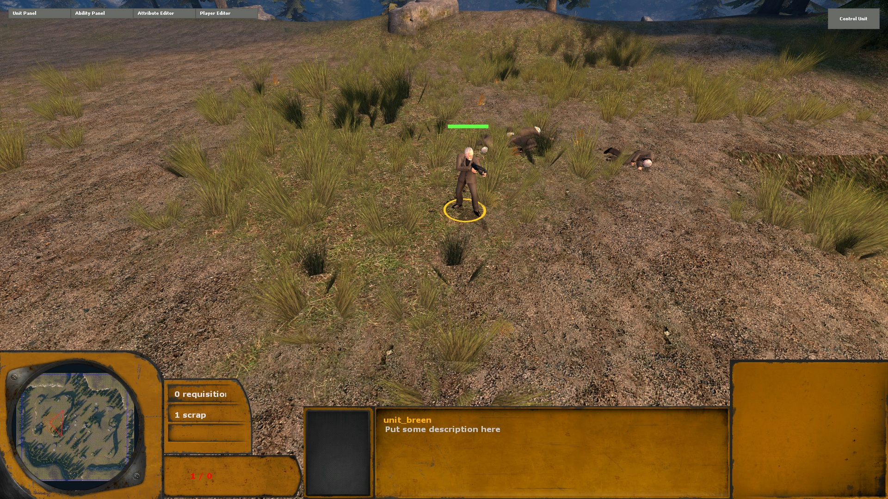
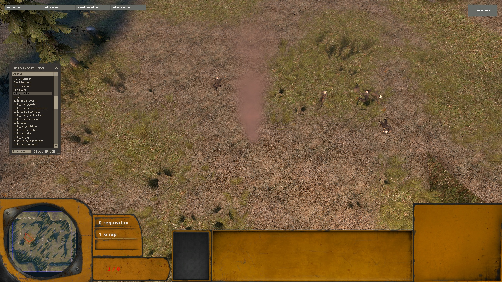

.. _tut-informal:

**********************************
An Introduction to Lambda Wars Python coding
**********************************
This introduction aims to give several informal examples of extending 
Lambda Wars (lambdawars) using Python. Before getting started it is highly 
recommended to read the informal introduction to Python in case you are not 
familiar with Python (http://docs.python.org/tutorial/introduction.html).

Getting started
============================
To write Python code you will need a text editor. Although you could use notepad,
it is not recommended. A popular choice is *notepad++* (see http://notepad-plus-plus.org/).
In case you use notepad++, do not forget to enable the option *replace by space* under 
*preferences->tab settings*. All code in lambdawars uses four spaces for indentation
(tip: use *view->show symbol->Show White Space and TAB* to visualize tabs/spaces).

Furthermore it is also useful to set lambdawars to windowed method. Right click lambdawars in
your steam games list and press properties. Then click *Set Launch Options* and 
add the following::

"-windowed -noborder -dev" (without quotes)

*-windowed* will launch the game in windowed mode, while *-noborder* will prevent windows 
from adding borders (saves some space). The *-dev* parameter will enable the console, 
allow developers/debug messages to printed to the console and prints console output in 
the top left corner of your screen ingame.

Now launch lambdawars and type in the open console::

    map hlw_forest
    
Press enter. The game will load the map hlw_forest in sandbox mode. 
Press ` (grave accent) to open the 
`console <http://developer.valvesoftware.com/wiki/Console>`_.

Executing python from the console
============================
You can execute python code using the following two commands:

* *spy code*: Executes python code on the server side

* *cpy code*: Executes python code on the client side

Try for example::

    spy print 'Hello World!'
    
This will print the text "Hello World!" to your console.

Defining a new basic unit
============================
Now alt tab back to Windows and open Windows Explorer. Navigate to the lambdawars mod folder. 
Your steam folder is usually located in ``C:\Program Files\steam`` (or ``C:\Program Files (x86)\steam`` 
in case you use the 64 bit version of Windows). The mod folder can then be found at 
``C:\Program Files\steam\steamapps\sourcemods\lambdawars\``.

Now go into the Python folder. This folder contains all Python code. The actual game code 
is in the game packages (also see next topic). Now go into the tutorial folder. This folder defines the 
game package "tutorial" and usually contains sub folders for the different abilities, units, etc. Now 
go into the units folder and create a new file *breen.py*. Open it in your text editor and add the 
following code::

    from core.units import UnitInfo
    class BreenInfo(UnitInfo):
        name = 'unit_breen'
        cls_name = 'unit_rebel'
        modelname = 'models/breen.mdl'
        hulltype = 'HULL_HUMAN'
        weapons = ['weapon_smg1']
        
The first line is an import statement and imports the :class:`core.units.UnitInfo` class. This class contains all default 
attributes for the new unit and automatically registers the unit when you define your new class. On the second 
line we start the definition of a new class derived from UnitInfo. The remaining lines are used to define 
variables. The *name* is used to refer to our new unit. It will appear in the unitpanel list and you can 
use it in combination with the *unit_create* command. *cls_name* refers to the entity class to spawn. In 
this case the entity is *unit_rebel*, defined in ``python/wars_game/units/rebel.py``. For all possible
attributes see :mod:`core.units.UnitInfo`.

Now save your file and then alt tab back into the game. Type the following::

    reload_gamepackage tutorial

The *__init__.py* script is set up to reload all python scripts in the units folder of the *tutorial* gamepackage.
You can also use the command py_reload to reload a  single file (e.g. *py_reload tutorial.units.zombreen*). 
Your newly defined unit should now appear in the unitpanel list. Select it, hold your mouse somewhere on the
map and press *space*. Our breen unit should now appear, behaving like a rebel soldier.

   
Defining a new ability
============================
In the previous section we actually defined a new ability that spawns the entity class 'unit_zombie' 
with the given settings. In this section we will make a simple ability that dispatches a particle
effect at the mouse position.

Alt tab back into Windows Explorer and go to ``tutorial/abilities``. Create a new file *smoke.py*.
Add the following into the newly created file::

    from core.abilities import AbilityTarget
    from vmath import QAngle 
    from particles import PrecacheParticleSystem, DispatchParticleEffect

    class SmokeAbility(AbilityTarget):
        name = 'ability_smoke'

        # This method is called once per map to precache the ability
        # In source engine you must first precache a particle before you can dispatch it.
        @classmethod           
        def Precache(info):
            PrecacheParticleSystem("steampuff")
        
        # isserver is special global that is True on the server side. 
        # In this case we only define DoAbility on the server.
        if isserver:
            # This method is executed when you left press your mouse button after activating
            # the ability. 
            def DoAbility(self):
                data = self.mousedata # Player mouse. The current player mouse data can be retrieved from self.player.GetMouseData()
                DispatchParticleEffect("steampuff", self.mousedata.groundendpos, QAngle())
                self.Completed()
        
Now save your file, go back into game and reload the gamepackage (``reload_gamepackage tutorial``). 
Look into the abilitypanel and your newly created ability *ability_smoke* should appear in the 
list. Select it, press execute and then right press somewhere in the map. The particle effect should
now appear.

   
.. seealso::

    :class:`core.abilities.AbilityTarget`
        Base class for abilities which are executed after targeting a location or entity with the mouse.
        
    :class:`core.abilities.AbilityInfo`
        All ability classes are derived from this class. It provides common functionality.

What Now?
============================
The next topics will assume you have basic Python knowledge. In case you do not feel familiar yet with 
Python you might want to read the Python tutorial (see http://docs.python.org/tutorial/) or alternatively
http://learnpythonthehardway.org/. 
Or just go ahead to the next topic and mess around.

You might also want to check out the wars library (see :ref:`library-index`). It contains documentation 
for the core game package.
