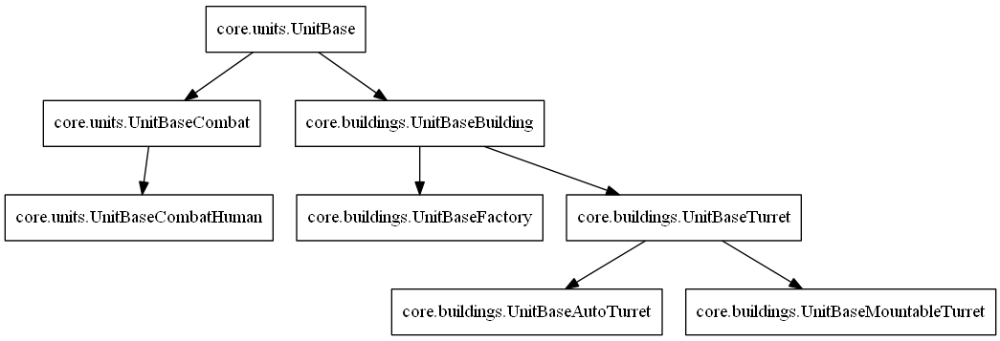
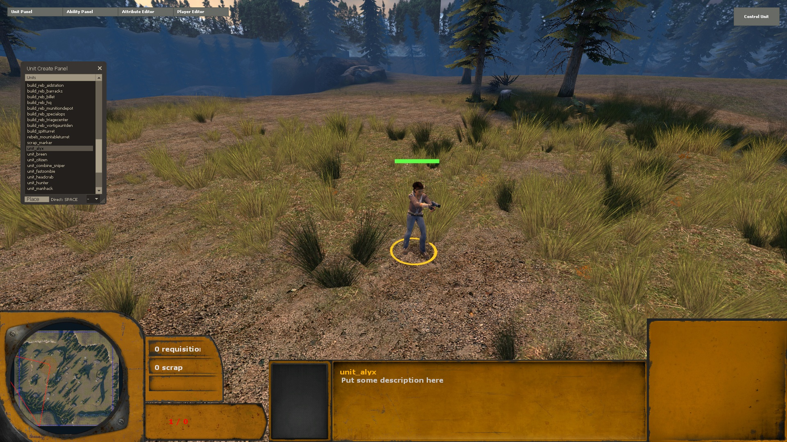
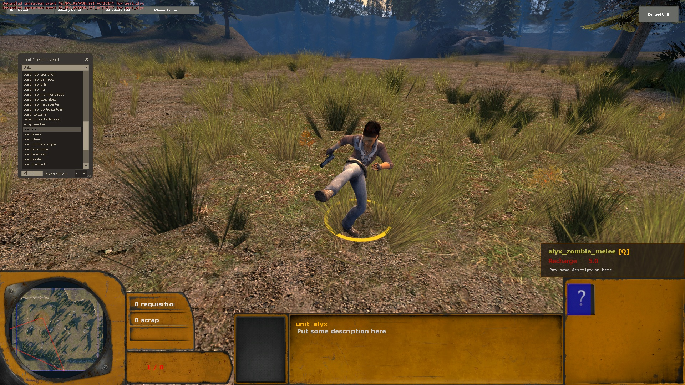

.. _tut-units:

**********************************
Units
**********************************
Creating new units is likely alongside creating new abilities the most fun
thing to do. Lambda Wars uses a fully customized npc (does not share 
anything with the original hl2 npc code) and has the following the following
key features:

  * Fully custom AI written in pure Python code and easy to extend.
  * Custom navigator class, which uses the Navigation Mesh for pathfinding and
    provides better local obstacle avoidance code for rts type of games.
  * Movement is controlled using a *forward* and *sideward* movement values.
    This makes it easy to switch between the player directly controlling the 
    unit or the navigator/ai having control.
  * Units use an animation state controller similar to players in recent
    Valve games. In Half-Life 2, NPC animations are fully controlled server 
    side, introducing unnecessary data traffic. Units only send small
    animation events when needed.
    
The following base classes are available for units:

The :class:`core.units.UnitBase` provides an empty template for units that don't
require anything fancy and most of the time you do not want to create a new unit 
using this class (except if extremely simple, like an Antlion grub).

:class:`core.units.UnitBaseCombat` is the base class you will use most of the 
time if you want to create a moving unit with AI and attack capabilities. Most
of the specialized functionality is moved into components. This unit uses the
following components:

  * :class:`core.units.UnitCombatLocomotion` - Deals with moving the unit 
    through the world (collision, velocity, acceleration, friction, etc). 
    As input it takes a reference to a :class:`core.units.MoveCommand`.
  * :class:`core.units.UnitCombatAnimState` - Decides which animation 
    should be played by looking at the moving speed and listening to events
    or other state variables.
  * :class:`core.units.UnitCombatNavigator` - Plans the unit path to a goal
    using the navigation mesh and avoid local obstacles. The output is an 
    updated :class:`core.units.MoveCommand`.
  * :class:`core.units.UnitCombatSense` - Builds a list of units that are 
    within view range of the unit. Currently this component is really simple
    due the large number of units (performance). The sensing component is
    used to update the current enemy of the unit.
  * :class:`core.units.BehaviorGeneric` - The default AI of the unit. Consists
    of a set of actions that decide where the unit will move to, what it will 
    attack and so on. This component is fully written in Python, making it
    easy to extend with custom code.
    
:class:`core.units.UnitBaseCombatHuman` is a small specialized class for human
like units. The main difference is it provides support for carrying and using
weapons.

:class:`core.buildings.UnitBaseBuilding` is the base class for buildings.
It provides the default functionality for constructing and destroying buildings.

See :mod:`core.units` for more information about 
the available ability classes and example usage.
    
Creating a new custom unit
============================
A completely new unit consists of a new entity derived from one of the unit
base classes and an information class. Create a new file *alyx.py* inside the 
units folder::

    from entities import entity, Activity
    from core.units import UnitInfo, EventHandlerAnimation
    from wars_game.units.citizen import UnitCitizen as BaseClass
    
    # Note: the unit must be networked because we define new animations/activities.
    # The animation state runs on both the server as the client.
    # This means the activitylist, acttables and events must be on both server and client.
    @entity('unit_alyx', networked=True)
    class UnitAlyx(BaseClass):
        # List for model specific activities
        # An activity maps to one or more sequences and can be weighted
        # A sequence is a single animation
        # You can add the activities of the model in the list here
        # Then you can access the activity using "self.ACT_DI_ALYX_ZOMBIE_MELEE" 
        # anywhere in your methods
        activitylist = list(BaseClass.activitylist)
        activitylist.extend([
            'ACT_DI_ALYX_ZOMBIE_MELEE',
        ])
        
        # Activity translation table dictionary
        # The unit animation state component uses some default activities for the different states
        # However these might not match the correct activities
        # When the unit has no weapon it will use the default entry. In case it has a weapon
        # it first looks for the entry matching the weapon class name. Otherwise it will default
        # to "weapon_default" entry.
        # The translation table is updated by calling UpdateTranslateActivityMap. This is automatically
        # done when the unit switches weapons.
        # Note that the Activity class contains all the shared activities
        acttables = dict(BaseClass.acttables)
        acttables.update({ 
            'default' : {
                Activity.ACT_MP_JUMP : Activity.ACT_JUMP,
                Activity.ACT_CROUCH : Activity.ACT_COVER_LOW,
                Activity.ACT_RUN_CROUCH : Activity.ACT_RUN_CROUCH_RIFLE,
            },
            'weapon_pistol' : {
                Activity.ACT_IDLE : Activity.ACT_RANGE_ATTACK_PISTOL,
                Activity.ACT_WALK : Activity.ACT_WALK_AIM_PISTOL,
                Activity.ACT_RUN : Activity.ACT_RUN_AIM_PISTOL,
                Activity.ACT_RANGE_ATTACK1 : Activity.ACT_RANGE_ATTACK_PISTOL,
                Activity.ACT_MP_JUMP : Activity.ACT_JUMP,
                Activity.ACT_CROUCH : Activity.ACT_COVER,
                Activity.ACT_RUN_CROUCH : Activity.ACT_RUN_CROUCH_RIFLE,
            },
        })
        
        # Add an event so we can trigger our custom npc activity
        # The handler must be a callable taking two arguments: the unit and data (integer)
        # In this case we create a predefined callable object that plays the given activity
        # You can now trigger the animation using "self.DoAnimation(self.ANIM_ALYX_ZOMBIE_MELEE)"
        events = dict(BaseClass.events)
        events.update( {
            'ANIM_ALYX_ZOMBIE_MELEE' : EventHandlerAnimation('ACT_DI_ALYX_ZOMBIE_MELEE'),
        } )
        
    class AlyxInfo(UnitInfo):
        name = 'unit_alyx'
        cls_name = 'unit_alyx'
        health = 500
        modelname = 'models/alyx.mdl'
        hulltype = 'HULL_HUMAN'
        costs = [('requisition', 5)] # List of costs required to start producing this unit
        buildtime = 5 # Build time in seconds when being produced at a building
        weapons = ['weapon_pistol'] # List of weapons. The last weapon in the list is the default active weapon
        
Now save the file and hit reload. *unit_alyx* should now appear in the list. Spawn alyx and she should appear with a pistol, using the correct activities as specified in the activity translation table. Now spawn some enemy antlions (in the right corner there is a drop down menu with "p1... p8", referring to the possible players). Alyx should start shooting them.

Triggering the animation
============================

We added the animation to our unit, except it is never used right now. We are going to change this by adding an ability that triggers the animation. Extend your import list as follows::

    from core.abilities import AbilityInstant

:class:`core.abilities.AbilityInstant` class immediately executes when you activate the ability. Now below the AlyxInfo class add the following code::

    class AbilityAlyxZombieMelee(AbilityInstant):
        name = 'alyx_zombie_melee'
        rechargetime = 5.0
        
        if isserver:
            def DoAbility(self):
                # SelectGroupUnits assigns all units with this ability in the player selection to self.units
                self.SelectGroupUnits() 
                for unit in self.units:
                    # Trigger the activity by sending the event
                    unit.DoAnimation(unit.ANIM_ALYX_ZOMBIE_MELEE)
                self.Completed()
                
The final step is to add the ability to your unit::

    class AlyxInfo(UnitInfo):
        # ....
        
        # abilities is a dictionary of slots mapping to abilities
        # It starts at the top row from left to right
        abilities = {
            0 : 'alyx_zombie_melee',
        }
            
Save the file, remove your existing unit and reload the tutorial gamepackage. Note that you must remove
the unit, reloading the game package will not automatically reload the existing units. A quick command to 
remove all units of a game package is *wars_pkg_remove_ents_all*. Now spawn a new instance of alyx and
the ability should appear. Try it out! 

Extending the AI
============================
Although the above approach triggers the animation, it does not guarantee it is fully
played. The AI of the unit might trigger another animation (like shooting or jumping).
Try it by executing the ability and then immediately order the unit to move to some 
location.

Thus a bettter approach would to extend the AI. We will do this by giving 
an order to do the ability with a custom action. Add the following custom 
action to the end of the file::

    if isserver:
        from core.units import BaseBehavior
        
        class ActionPlayAnimation(BaseBehavior.ActionAbility):
            # Only define a OnStart method which immediately triggers the animation and
            # then returns a transition to another action that waits until the complete animation is played.
            # This action itself will transition into the idle action when done.
            def OnStart(self):
                self.outer.DoAnimation(self.outer.ANIM_ALYX_ZOMBIE_MELEE)
                return self.ChangeTo(self.behavior.ActionWaitForActivityTransition, 'Waiting for activity',
                                     activity=self.outer.animstate.specificmainactivity, transitionaction=self.behavior.ActionIdle)
                                     
:class:`core.units.BaseBehavior.ActionAbility` is the base action class for ability orders and is always
initialized with the instance of the order. In this case we play the animation and immediately change
to :class:`core.units.BaseBehavior.ActionWaitForActivityTransition`, which waits until the animation
finished playing and then changes to the specified new action (in this case the idle action).
            
Now replace the contents of the DoAbility method with the following code::

    # SelectGroupUnits assigns all units with this ability in the player selection to self.units
    self.SelectGroupUnits() 
    self.behaviorgeneric_action = ActionPlayAnimation
    for unit in self.units:
        # Queue a new ability order to the order stack of the unit
        # When the unit processes the order it will change from
        # ActionIdle to ActionPlayAnimation.
        unit.AbilityOrder(ability=self)
    self.Completed()
    
Reload the code and try it out. Order your unit to move to some location while playing the 
animation. The unit will not do this until the complete animation finished playing.

Debug commands
============================
There are several useful debug commands you can use when coding new units:

    * unit_showactions - Displays the active action above all units.
    * unit_showroute - Visualizes the current route if any of all units.
    * developer 2 - Apart from any other developer message, this will print changes in the current action to the developers console.
    * unit_navigator_debug 1 - Prints changes and events in the unit navigator to the developers console.
    